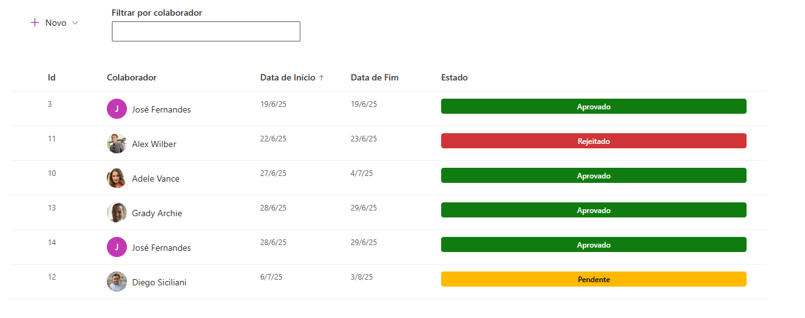
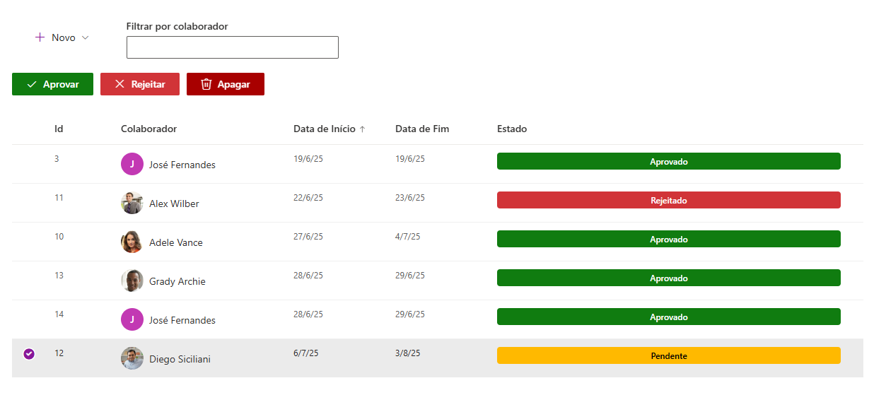
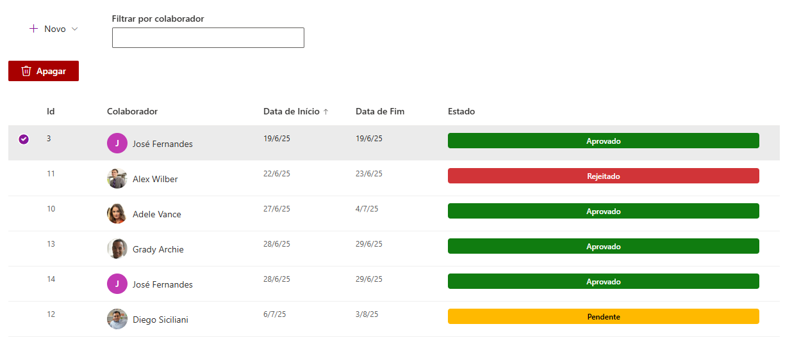
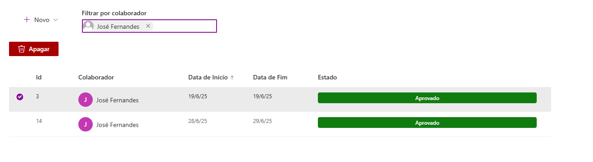
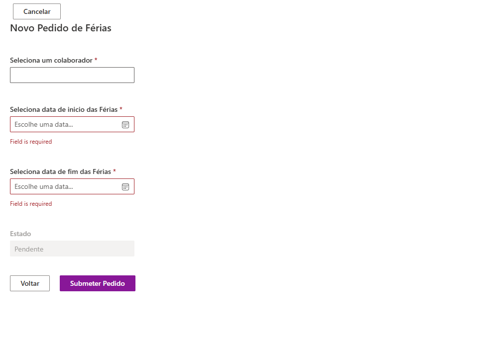

# Pedidos de Férias

Web part SPFx para gerir pedidos de férias dentro do SharePoint Online. Os dados vivem numa lista SharePoint (`Pedidos_de_Ferias`) e a web part dá-lhe uma interface decente por cima: submeter um pedido, ver todos numa grelha com filtro por colaborador, e aprovar, rejeitar ou apagar.

Foi feita para ser colocada numa página SharePoint (ou como tab do Teams — o manifesto declara esses hosts), sem backend próprio. Tudo o que faz passa pela REST API do SharePoint, via PnPjs, com o token do utilizador que está a ver a página.


## Funcionalidades

- **Submissão de pedidos** num painel lateral: escolhe-se o colaborador (PeoplePicker), a data de início e a data de fim. O estado é fixo em `Pendente` e não é editável no formulário.
- **Validação no cliente** antes de gravar: colaborador preenchido, ambas as datas preenchidas, início não posterior ao fim, e nenhuma das datas no passado. Os erros aparecem numa `MessageBar` no topo do painel e num diálogo.
- **Listagem** em `DetailsList` com colunas Id, Colaborador, Data de Início, Data de Fim e Estado. Por omissão ordena por data de início ascendente; qualquer cabeçalho é clicável para ordenar.
- **Filtro por colaborador** através de um PeoplePicker ao lado da command bar. O filtro é aplicado em memória, por comparação de email — não faz nova query ao SharePoint.
- **Aprovar / Rejeitar** — os botões só aparecem quando está uma linha selecionada e essa linha está `Pendente`. Ambos pedem confirmação e escrevem só a coluna `Estado`.
- **Apagar** — disponível para qualquer linha selecionada, independentemente do estado, também com confirmação.
- **Fotos dos colaboradores** carregadas via Microsoft Graph (`/users/{email}/photo/$value`) e mostradas num `Persona` que faz zoom em hover. As fotos são cacheadas em estado por email e os object URLs são revogados no unmount.
- **Estado com cor**: verde para `Aprovado`, vermelho para `Rejeitado`, amarelo para `Pendente`.

## Stack

| Camada | O que é usado |
|---|---|
| Web part | SPFx 1.20.0, `BaseClientSideWebPart` |
| UI | React 17 (componentes de classe), Fluent UI 8, `@pnp/spfx-controls-react` (PeoplePicker) |
| Acesso a dados | PnPjs 4 (`@pnp/sp`) sobre a REST API do SharePoint |
| Fotos | `MSGraphClientFactory` do contexto SPFx |
| Build | Gulp 4 + `@microsoft/sp-build-web`, TypeScript 4.7.4, ESLint |

## A lista SharePoint

A web part não cria nada. É preciso existir, no site onde a colocas, uma lista com o título exato **`Pedidos_de_Ferias`** e estas colunas (os nomes internos têm de bater certo):

| Nome interno | Tipo |
|---|---|
| `Colaborador` | Person or Group |
| `Data_Inicio` | Date and Time |
| `Data_Fim` | Date and Time |
| `Estado` | Single line of text |

O `Estado` é texto livre, mas o código só reconhece os valores `Pendente`, `Aprovado` e `Rejeitado` — qualquer outro valor é mostrado a cinzento e não permite aprovar nem rejeitar.

O nome da lista está numa constante no topo de `PedidosDataProvider.ts`:

```ts
const LIST_PEDIDOS = "Pedidos_de_Ferias";
```

## Estrutura do projeto

```
├─ config/                          configuração de build do SPFx
│  ├─ config.json                   bundle + recursos localizados
│  ├─ package-solution.json         metadados e id da solução (.sppkg)
│  └─ serve.json                    porta e workbench do gulp serve
├─ docs/
│  ├─ architecture.md               como a aplicação está montada por dentro
│  └─ images/                       capturas de ecrã usadas neste README
├─ teams/                           ícones para o manifesto do Teams
└─ src/webparts/pedidos/
   ├─ PedidosWebPart.ts             entrypoint: inicializa o PnPjs e monta o React
   ├─ PedidosWebPart.manifest.json  id, hosts suportados, entrada pré-configurada
   ├─ loc/                          strings do scaffold (ver nota mais abaixo)
   └─ components/
      ├─ IPedidosProps.ts           props passadas do web part para o React
      ├─ Pedidos.tsx                componente de topo, delega na listagem
      └─ pedidos/
         ├─ Models/pedidos/         IPedidos + classe Pedidos
         ├─ list/                   DetailsListPedidos — o grosso da aplicação
         ├─ create/                 FormPedidosCreate — formulário de submissão
         ├─ sharePointDataProvider/ PedidosDataProvider — CRUD via PnPjs
         └─ utils/                  command bar, filtro e setup do PnPjs
```

Para perceber como estas peças se ligam, ver [`docs/architecture.md`](docs/architecture.md).

## Correr localmente

Precisas de Node 18 (o `package.json` restringe a `>=18.17.1 <19.0.0`) e de acesso a um tenant SharePoint Online.

```bash
npm install
```

Na primeira vez em que corres o workbench, é preciso confiar no certificado de desenvolvimento:

```bash
npx gulp trust-dev-cert
```

Depois:

```bash
npx gulp serve --nobrowser
```

O `gulp serve` está mapeado para o modo *deprecated* (ver `gulpfile.js`), por isso serve os bundles em `https://localhost:4321`. Como a web part lê de uma lista SharePoint real e usa o Graph, **o workbench local não serve para nada** — abre antes o workbench alojado no teu tenant:

```
https://<tenant>.sharepoint.com/sites/<site>/_layouts/15/workbench.aspx
```

O site tem de ser o mesmo onde existe a lista `Pedidos_de_Ferias`. Há uma configuração de debug pronta no VS Code (`Hosted workbench`) — basta substituir `{tenantDomain}` em `.vscode/launch.json`.

## Build e deploy

Para gerar o pacote de produção:

```bash
npx gulp clean
npx gulp bundle --ship
npx gulp package-solution --ship
```

O `.sppkg` fica em `solution/pedidos.sppkg`. Esse ficheiro é output de build e **não está no repositório** — o `.gitignore` exclui-o de propósito.

Para instalar:

1. Carregar o `.sppkg` no **App Catalog** do tenant (SharePoint Admin → More features → Apps → App Catalog).
2. Confiar na app quando for pedido. A solução tem `skipFeatureDeployment: true`, por isso fica disponível em todos os sites sem instalação por site.
3. Adicionar a web part "Pedidos" a uma página do site onde existe a lista.

### Permissões do Microsoft Graph

As fotos dos colaboradores são pedidas ao Graph através do `MSGraphClientFactory`. O `package-solution.json` **não** declara `webApiPermissionRequests`, portanto a web part depende apenas das permissões já concedidas ao *SharePoint Online Client Extensibility Web Application Principal* no tenant (SharePoint Admin → Advanced → API access).

Se não houver uma permissão de leitura de utilizadores (`User.Read.All` ou equivalente), o pedido de foto falha, o código apanha o erro e mostra as iniciais do colaborador. **Não quebra nada** — é degradação graciosa. Se quiseres que as fotos apareçam sempre, tens de declarar a permissão no `package-solution.json` e aprová-la no Admin Center.

## Testes

Não há testes. O `package.json` tem um script `test` porque veio do scaffold do Yeoman, mas `gulp test` não encontra nada para correr.

## Notas técnicas

**Inicialização do PnPjs.** O `pnpjsConfig.ts` guarda a instância `SPFI` num singleton de módulo. O `PedidosWebPart.onInit()` chama `getSP(context)` antes de qualquer render, o que popula o singleton. A partir daí, tanto o `PedidosDataProvider` como o setter `webPartContext` recebem a mesma instância — o `getSP` só cria uma nova quando `_sp` ainda está vazio, portanto as chamadas seguintes são no-ops.

**Props não consumidas.** O `PedidosWebPart` passa `description`, `isDarkTheme`, `environmentMessage`, `hasTeamsContext` e `userDisplayName` pela árvore de componentes, mas nenhum componente as lê. Só o `context` é usado (para o PnPjs, para o PeoplePicker e para o Graph). São restos do scaffold — ficaram porque remover a interface obrigaria a tocar em todas as assinaturas.

**Strings localizadas.** A pasta `loc/` continua a ser referenciada em `config/config.json` (`localizedResources`) e é necessária para o build, mas nenhum componente importa `PedidosWebPartStrings`. Toda a UI tem texto em português escrito diretamente no JSX.

**Painel de propriedades vazio.** O `getPropertyPaneConfiguration()` devolve `pages: []` de propósito — não há nada configurável na web part. O nome da lista está hardcoded.

**Ordenação in-place.** O `_copyAndSort` usa `Array.prototype.sort`, que ordena o array original. Como recebe ora `this.state.items` ora `this._allItems`, ambos acabam reordenados. Na prática não dá problemas porque a lista é sempre reconstruída do zero a cada `_LoadPedidos()`.

**Confirmações nativas.** Aprovar, rejeitar e apagar usam `confirm()` e `alert()` do browser em vez de diálogos Fluent UI.

## Limitações conhecidas

- **Não há controlo de permissões na aplicação.** Qualquer utilizador que veja a web part vê os botões Aprovar, Rejeitar e Apagar, para pedidos de qualquer pessoa. A única barreira real são as permissões da própria lista SharePoint — se um utilizador tiver permissão de edição na lista, pode aprovar o seu próprio pedido. Não existe conceito de "aprovador".
- **A data de hoje é sempre rejeitada na submissão.** A validação compara a data escolhida no `DatePicker` (meia-noite) com `new Date()` (hora atual), portanto escolher hoje cai sempre no ramo "não pode ser anterior a hoje". Só funcionam datas de amanhã em diante.
- **`updateEstado()` não está na interface.** O `PedidosDataProvider` implementa o método, mas `IPedidosDataProvider` só declara `getItems`, `createItem` e `deleteItem`. Quem programar contra a interface não o vê.
- **O filtro é só em memória.** Todos os pedidos da lista são carregados de uma vez, sem paginação nem `$top`. Com uma lista grande, o primeiro carregamento fica pesado e o limite de 5000 itens do SharePoint acabará por aparecer.
- **Sem notificações.** Aprovar ou rejeitar não envia email nem avisa o colaborador de forma nenhuma.

## Melhorias futuras

- Tornar o nome da lista configurável no painel de propriedades em vez de constante no código.
- Restringir Aprovar/Rejeitar a um grupo SharePoint de aprovadores, e impedir que alguém aprove o seu próprio pedido.
- Corrigir a comparação de datas normalizando para meia-noite antes de validar.
- Substituir `confirm()`/`alert()` por `Dialog` do Fluent UI, consistente com o resto da UI.
- Paginação ou filtragem server-side (`$filter` no PnPjs) em vez de carregar a lista inteira.
- Declarar `webApiPermissionRequests` no `package-solution.json` para que as fotos do Graph não dependam de configuração manual do tenant.
- Notificação por email (ou Power Automate na lista) quando um pedido muda de estado.
- Testes — nem que seja ao `PedidosDataProvider` com o SPFI mockado.

## Capturas de ecrã

**Listagem de pedidos**



**Pedido pendente selecionado — aparecem Aprovar e Rejeitar**



**Pedido já aprovado ou rejeitado — só resta Apagar**



**Filtro por colaborador**



**Formulário de novo pedido**



## Autor

José Fernandes — Lisboa, Portugal
[LinkedIn](https://www.linkedin.com/in/jose-fernandes00/) · [GitHub](https://github.com/zemanel20)

## Licença

© 2025 José Fernandes. Todos os direitos reservados. A utilização, modificação ou distribuição deste software requer autorização expressa.

## Referências

- [SPFx — Getting started](https://learn.microsoft.com/en-us/sharepoint/dev/spfx/set-up-your-developer-tenant)
- [Usar as APIs do Microsoft Graph no SPFx](https://learn.microsoft.com/en-us/sharepoint/dev/spfx/web-parts/get-started/using-microsoft-graph-apis)
- [PnPjs](https://pnp.github.io/pnpjs/)
- [PnP SPFx controls (PeoplePicker)](https://pnp.github.io/sp-dev-fx-controls-react/controls/PeoplePicker/)
- [Fluent UI](https://developer.microsoft.com/en-us/fluentui)
